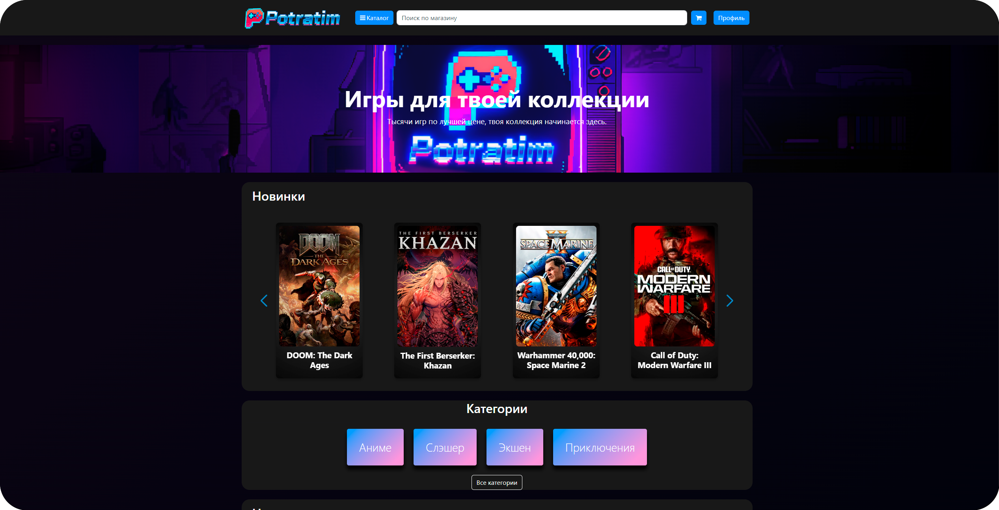
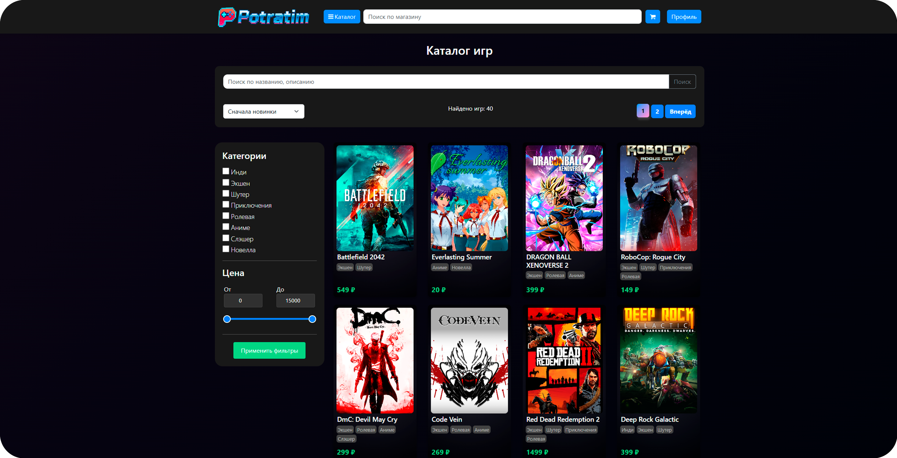
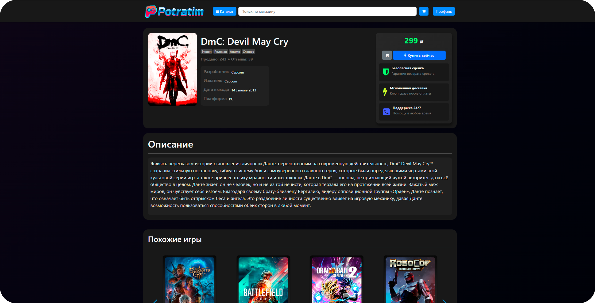
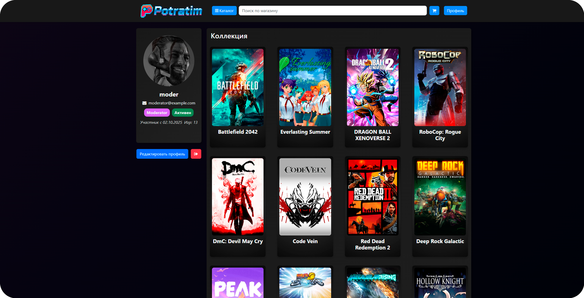
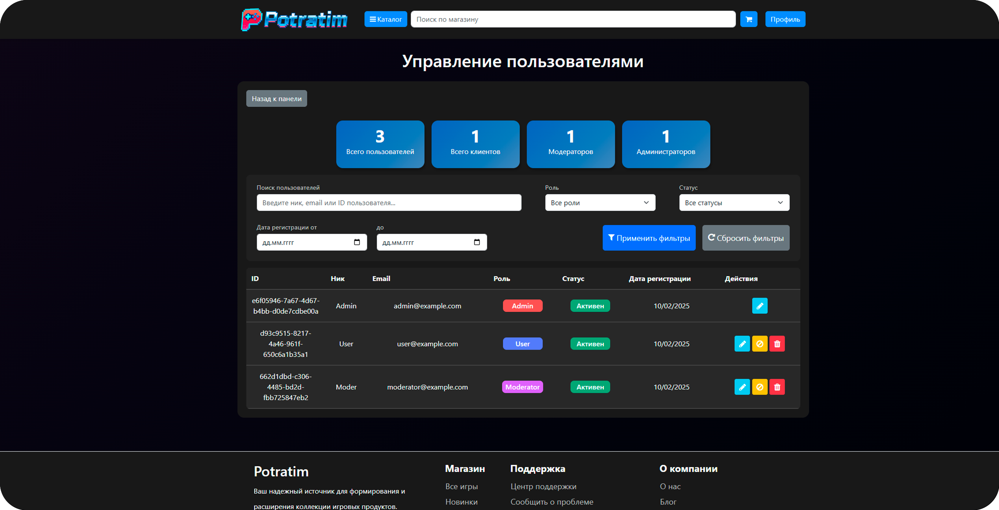

[](https://dotnet.microsoft.com/en-us/download/dotnet/9.0)
[](https://learn.microsoft.com/en-us/aspnet/core)
[](https://learn.microsoft.com/en-us/ef/core/)
[](https://www.postgresql.org/docs/16/)


<p align="center">
  
</p>

<h1 align="center">🎮 Potratim — Ваша игровая коллекция начинается здесь</h1>

**Potratim** — это современная цифровая платформа, где видеоигры обретают новый смысл, становясь частью вашей личной коллекции. Проект реализован на современном стеке технологий ```ASP.NET Core``` **и** ```PostgreSQL```. Проект был разработан как учебный, нацеленный на глубокое освоение **веб-разработки**.

## ✨ Особенности

### 🛒 Торговая платформа
- **Умный каталог** с продвинутыми фильтрами и поиском
- **Глобальный поиск** по всему ассортименту игр
- **Категоризация** для удобной навигации
- **Корзина покупок** доступна всем пользователям

### 👥 Социальные возможности
- **Многоуровневая система ролей** (Admin, Moderator, User)
- **Персональные профили** с витриной приобретённых игр
- **Система отзывов и оценок** для формирования рейтингов

### ⚙️ Управление контентом
- **Комплексная админ-панель** для полного контроля
- **Управление пользователями** и правами доступа
- **Модерация контента** и отзывов


## 🛠 Технологический стек

| Компонент | Технология |
|-----------|------------|
| **Фреймворк** | .NET 9.0 |
| **Веб-платформа** | ASP.NET Core MVC 9.0 |
| **База данных** | PostgreSQL 16 |
| **ORM** | Entity Framework Core 9.0 |
| **Аутентификация** | ASP.NET Identity |


## 🗃️ Структура проекта
```
📦 src                           # Корневая директория проекта
├── 📂Areas                      # Области приложения для разделения функциональности
│   └── 📂Admin                  # Административная панель
│       ├── 📂Controllers        # Контроллеры для управления контентом
│       └── 📂Views              # Представления админ-панели
├── 📂Components                 # View Components для повторного использования UI
├── 📂Controllers                # Основные контроллеры приложения
│   └── 📂Api                    # API контроллеры 
├── 📂Data                       # Работа с базой данных
│   ├── 📄PotratimDbContext.cs   # Контекст базы данных Entity Framework
│   └── 📄SeedData.cs            # Сидирование начальных данных (роли, категории)
├── 📂Migrations                 # Миграции базы данных Entity Framework
├── 📂Models                     # Модели данных (сущности)
├── 📂Properties                 # Системные свойства проекта
├── 📂Services                   # Бизнес-логика и сервисы
├── 📂ViewModel                  # Модели представлений (VM)
├── 📂Views                      # Представления MVC
└── 📂wwwroot                    # Статические файлы (доступны извне)
    ├── 📂css                    # CSS файлы проекта
    ├── 📂images                 # Изображения проекта
    │   ├── 📂avatars            # Аватары пользователей
    │   └── 📂game-images        # Изображения игр
    ├── 📂js                     # JavaScript файлы проекта
    └── 📂lib                    # Внешние библиотеки
```
## 🖼️ Скриншоты
<p align="center">
    
    
    
    
    
</p>

## 🐋 Быстрый старт через Docker
### ⚙️ Подготовка среды
- [Docker Desktop](https://www.docker.com/products/docker-desktop/) (Windows/Mac) или `docker.io` (Linux)
- [Docker Compose](https://docs.docker.com/compose/)
#### Установка на Linux
``` bash
sudo apt install docker.io
sudo apt install docker-compose
```

### 🚀 Команды для запуска
``` bash
 git clone https://github.com/vZidv/Potratim.git
 cd Potratim
```
После нужно установить пароль для **базы данных** в файле окружения ```.env```, как пример заполнения есть файл ```.env.example```.

``` bash
echo POSTGRES_PASSWORD=YourStrongPassword123 >> .env
docker-compose up --build
```

После запуска будут развернуты два **контейнера**:  
- **PostgreSQL** (база данных)
- **Само web Приложение** (Potratim)

По умолчанию сайт будет доступен на порту ``8080`` (http://localhost:8080).

## 🌱 Seed data

При первом запуске приложения автоматически выполняется инициализация **базы данных** с демонстрационными данными:

- 🎯 **8 игровых категорий** - Экшен, Шутер, Ролевые, Инди, Приключения, Аниме, Слэшер, Новелла
- 🎮 **40 уникальных игр** - с подробными описаниями, ценами и изображениями
- 👥 **Тестовые учетные записи** с разными уровнями доступа

| Роль | Логин | Пароль | Доступ |
|------|-------|--------|---------|
| **Administrator** | `admin` | `admin123` | Полный доступ ко всем функциям системы |
| **Moderator** | `moder` | `moder123` | Управление контентом и модерация отзывов |
| **User** | `user` | `user123` | Стандартный пользовательский функционал |

## 📬 Контакты
✉️ **Email**: [diz.shulinus@yandex.ru](mailto:diz.shulinus@yandex.ru)  
📱 **Telegram**: [@mysarias](https://t.me/mysarias)


>🚨 **Внимание!** Этот проект является учебным. Все представленные игры и данные являются демонстрационными.
